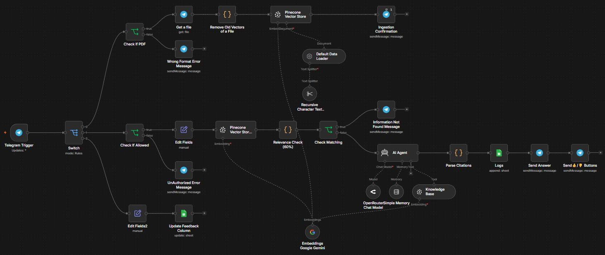

# Document Q&A Bot (RAG on Telegram)

## Problem statement
Support and operations teams lose time manually searching long internal documents to answer repetitive questions quickly and accurately.

## Architecture

## Tech stack

## Setup instructions
1. Import `Document Q&A Bot (RAG on Telegram).json` into n8n.
2. Create and connect credentials (use your own values):
   - Telegram Bot API
   - Pinecone API
   - Google Gemini API
   - OpenRouter API
   - Google Sheets OAuth2
3. Configure placeholders in the workflow:
   - `YOUR_SHEET_ID`
   - `YOUR_SHEET_GID`
   - `YOUR_CREDENTIAL_ID`
4. Point Pinecone settings to your own index and namespace.

## Workflow JSON
[Download workflow JSON](./Document%20Q%26A%20Bot%20(RAG%20on%20Telegram).json)

## Demo

