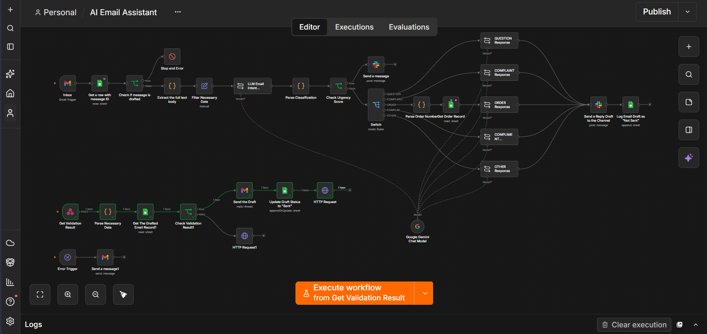

# AI Email Assistant

## Problem statement
Teams handling growing inbox volume need faster, consistent replies without losing human oversight on sensitive responses.

## Architecture

## Tech stack

## Setup instructions
1. Import `AI Email Assistant.json` into n8n.
2. Create and connect credentials (use your own values):
   - Gmail OAuth2
   - Google Sheets OAuth2
   - Slack API
3. Configure placeholders in the workflow:
   - `YOUR_SHEET_ID`
   - `YOUR_SHEET_GID`
   - `YOUR_SLACK_CHANNEL_ID`
   - `YOUR_CREDENTIAL_ID`
4. Enable the Gmail trigger and webhook nodes after validating permissions.

## Workflow JSON
[Download workflow JSON](./AI%20Email%20Assistant%20(2).json)

## Demo

